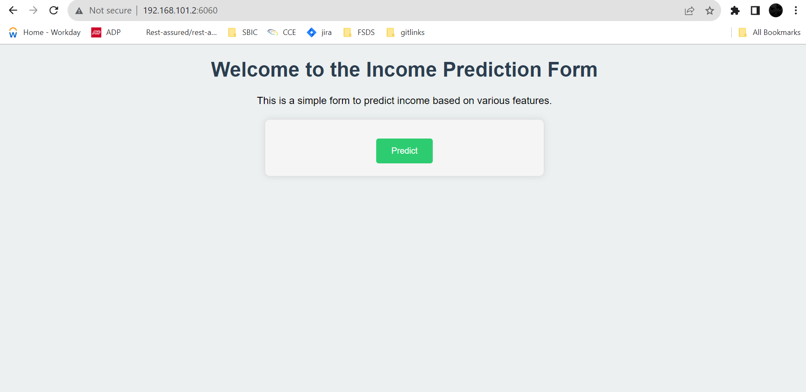

# Adult Census Income-Prediction-
## End To End Project 

This is a classification problem where we need to predict whether a person earns more than a sum of 50,000 k anuually or not. This classification task is accomplished by using a XGB Classifier trained on the dataset extracted by Barry Becker from the 1994 Census database. The dataset contains about 33k records and 15 features which after all the implementation of all standard techniques like Data Cleaning, Feature Engineering, Feature Selection, Outlier Treatment, etc was feeded to our Classifier which after training and testing, was deployed in the form of a web application.

......

## Input

